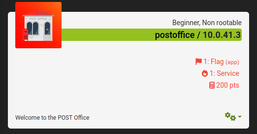

# Network - CTF Beginners

### Target list

* [x] [bender](network-ctf-beginners.md#bender)
* [x] [headoffice](network-ctf-beginners.md#headoffice)
* [x] [hostel](network-ctf-beginners.md#hostel)
* [x] [idiotr](network-ctf-beginners.md#idiotr)
* [x] [argonauts](network-ctf-beginners.md#argonauts)
* [x] [getip](network-ctf-beginners.md#getip)
* [x] [postoffice](network-ctf-beginners.md#postoffice)
* [ ] theloginofshame
* [ ] 6letter-juggler
* [ ] juggling-flea
* [ ] lightswitch
* [ ] netz-arbeiter
* [ ] pii-scamer
* [ ] redirector
* [ ] redirectorate
* [ ] squireli
* [ ] stackler
* [ ] turbine

***

### bender

<figure><figcaption>
Descripción del reto bender
</figcaption></figure>

Para este reto se encuentran dos flags, al entrar a la dirección IP del reto nos encontramos con un bender, el robot de Futurama, por lo que esto nos da un indicio de que algo se podría encontrar dentro del robots.txt.

<figure><figcaption>
Primera flag del reto Bender, dentro de robots.txt
</figcaption></figure>

Además de darnos la flag, nos da la ruta de un directorio llamado nogooglebot en el que al entrar se nos recibe con un Bender que nos indica que miremos más cerca.

<figure><figcaption>
Segunda flag del reto Bender, dentro del código fuente del directorio que nos proporciona la primera flag
</figcaption></figure>

Al analizar el código fuente de la página dentro del código podemos encontrar que dentro del texto que nos indica que miremos mas cerca también esta comentada la segunda flag.

***

### headoffice

<figure><figcaption>
Descripción del reto headoffice
</figcaption></figure>

Desde la descripción del reto y el nombre se nos recalca que los headers o cabeceras son una parte importante del reto. Además al entrar a la página web que tiene el servicio se nos comenta sobre **GET,** que todo el mundo sabe cómo hacer un GET, pero que si podemos adivinar la otra.

<figure><figcaption>
Inicio de la página del reto
</figcaption></figure>

Al hacer una solicitud de los headers desde la herramienta curl, podemos visualizar la flag. _El comando curl con la opción -I nos regresa las cabeceras de respuesta._

<figure><figcaption>
Flag del reto headoffice
</figcaption></figure>

***

### hostel

<figure><figcaption>
There is a hidden site on this system, but you'll have to guess the proper Host header.
</figcaption></figure>

Para este reto se nos menciona mucho el termino de Host, y al entrar al sitio nos dice que si podemos encontrar el ETSCTF host.

Por lo que haciendo uso de una herramienta de proxy web, cómo lo es Burpsuite nos pondremos a escuchar el tráfico para poder manipular los paquetes.

<figure><figcaption></figcaption></figure>

Una  vez que estemos escuchando al hacer la petición de GET podemos ver los encabezados de la petición, enviaremos la petición al repeater para hacer mas fácil el proceso.

Desde el repeater podemos ver la petición que estamos haciendo junto a la respuesta que nos da el sitio web

<figure><figcaption></figcaption></figure>

Recordando un poco podemos notar que el encabezado Host esta presente, encabezado que se menciona mucho desde el nombre de reto y su descripción, podemos probar distintos Host cambiando el valor que por defecto sera la IP o dominio del servidor por otro que nosotros queramos y dar al botón "Send" para ver la respuesta que nos da. Probando y analizando nos daremos cuenta que la respuesta sigue siendo la misma, "Can you find the hidden **ETSCTF** host?",  entonces probaremos ese Host

<figure><figcaption>
flag del reto hostel
</figcaption></figure>

Al probar con este nombre de host el servidor nos responderá con una página diferente que ya contiene nuestra flag.

***

### idiotr

<figure><figcaption>
See if you can find the <em>hidden</em> page. Do not overcomplicate things, keep it simple.
</figcaption></figure>

Para este reto al entrar a la página web se nos muestra un home con un navbar que nos permite acceder a otras páginas.

<figure><figcaption></figcaption></figure>

Al movernos entre las páginas del navbar podemos ver que se sigue haciendo una petición GET al mismo recurso, sin embargo se añade un parámetro id, al leer de nuevo la descripción del reto nos menciona que mantengamos las cosas simples, por lo que analizando un poco el id comienza desde el número 2 hasta el 4.

<figure><figcaption>
 Una vez que pasamos a un número más alto que 5 nos dice que necesitamos un login.
</figcaption></figure>

<figure><figcaption></figcaption></figure>

Regresamos al 1, al pasar el parámetro 1 en el id se nos mostrará la flag.

***

### argonauts

<figure><figcaption>
JaSON and the Argonauts invite you to join them in the search of the missing endpoints
</figcaption></figure>

Para este reto se nos presenta un servidor de JSON, con algunos endpoints de API que han sido perdidos. Al entrar podemos ver que se nos da una pista de cómo es que funciona el json-server a través de un enlace al repositorio oficial de GItHub.

<figure><figcaption></figcaption></figure>

Al hacer una pequeña búsqueda sobre el repositorio podemos ver que se describen los pasos que se tienen que seguir para empezar a utilizar el servidor, al analizar estos pasos podemos ver que el servidor se inicia haciendo referencia a un archivo **db.json** o **db.json5** que contiene todos los endpoints del servidor, lo que nos hace pensar que podría ser el mismo archivo sobre el cual también se ha iniciado este reto.

<figure><figcaption>
Flags del reto argonauts
</figcaption></figure>

Al consultar el endpoint podremos ver las 3 flags que incluye el reto. **Este reto también se puede resolver por fuerza bruta, usando un fuzzer. Intentarlo de esta forma para ganar experiencia con este tipo de herramientas. **_**Recomendamos: gobuster**_

***

### getip

<figure><figcaption>
When your web request is forwarded through web servers, there is a header that is being added that notifies the next server, who is this request forwarded for... In order to solve this you will have to make your IP appear as either localhost or 127.0.0.1.
</figcaption></figure>

Al entrar al sitio del reto podemos ver un sitio que nos muestra que nuestra IP no esta permitida, recordando un poco de la descripción del reto podemos notar que se hace referencia a un encabezado de HTTP que permite decirle al siguiente servidor quien ha reenviado esta petición, también nos dice que debemos usar localhost o 127.0.0.1.

Haciendo una busqueda en internet podemos encontrar cómo haciendo uso de la herramienta burpsuite podemos agregar este encabezado a nuestra petición.



<figure><figcaption>
flag del reto getip
</figcaption></figure>

Al agregar este header a nuestra petición HTTP podemos obtener nuestra flag

***

### postoffice

<figure><figcaption>
Welcome to the POST Office! Have you decided what you're going to post?
</figcaption></figure>

Este reto es muy similar al de [headoffice](network-ctf-beginners.md#headoffice), en este igual se hace referencia a los tipos de solicitud HTTP que podemos hacer. Al entrar a la página tendremos un texto que nos da pistas sobre que es una solicitud alternativa a GET, por lo que a través de la herramienta curl enviamos una solicitud POST al servidor con la opción _-X POST_

<figure><figcaption>
flag del reto postoffice
</figcaption></figure>

Al hacer la solicitud POST a la URL, obtendremos nuestra flag.

***
