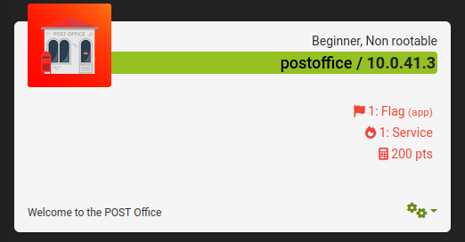

# postoffice

<figure><figcaption>
Welcome to the POST Office! Have you decided what you're going to post?
</figcaption></figure>

Este reto es muy similar al de [headoffice](./#headoffice), en este igual se hace referencia a los tipos de solicitud HTTP que podemos hacer. Al entrar a la página tendremos un texto que nos da pistas sobre que es una solicitud alternativa a GET, por lo que a través de la herramienta curl enviamos una solicitud POST al servidor con la opción _-X POST_

<figure><figcaption>
flag del reto postoffice
</figcaption></figure>

Al hacer la solicitud POST a la URL, obtendremos nuestra flag.